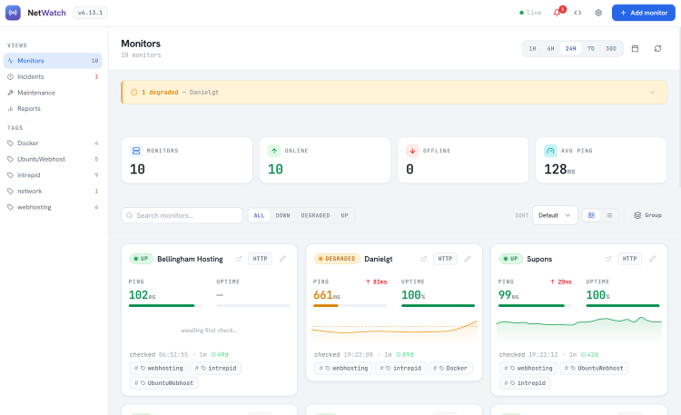
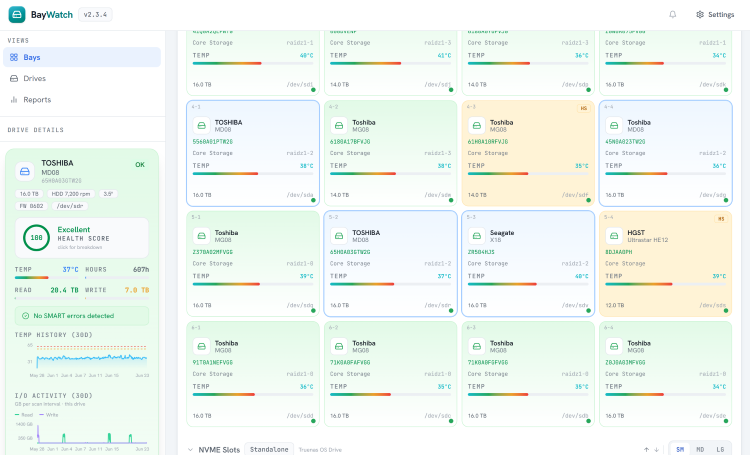

# Hi, I'm Daniel

### Senior Solutions Architect · Builder of Self-Hosted Things · Homelab Enthusiast

I design and ship production systems for enterprise clients by day, and run a small fleet of self-hosted tools, side projects, and a local hosting business by night. I like infrastructure I can reason about end to end, and software that earns its keep.

 

---

## 🛠️ What I Work With

I'm comfortable owning a feature from infrastructure to UI: provisioning the cluster, wiring the services, building the API, and shipping the client. Lately a lot of my building has centered on self-hosted LLM tooling and a reusable sync backend that lets me stand up new apps quickly.

---

## 🚀 Featured Projects

<table>
<tr>
<td width="50%" valign="top">

  

Self-hosted uptime monitoring for developers, homelabbers, and small teams. Makes real HTTP/S, TCP, and ICMP checks on configurable intervals and pushes every result to the browser instantly via Server-Sent Events — no polling, no page refreshes. Supports Telegram, email, and SMS alerts; scheduled status reports; SSL certificate expiry tracking; and per-monitor embed widgets.

 

 

  

</td>
<td width="50%" valign="top">

  

Self-hosted drive bay map for NAS boxes and servers. Builds a visual grid of every drive and slot with live SMART health scores, temperature tracking, ZFS pool integration, warranty alerts, and federation across multiple hosts. Works on TrueNAS Scale, Unraid, or any Linux Docker host.

 

 

   

</td>
</tr>
</table>

---

## 🏗️ Homelab & Infrastructure

The lab where most of the above actually runs:

| Layer | Stack |
|---|---|
| **Virtualization** | Proxmox — 3-node cluster |
| **Orchestration** | k3s |
| **Storage** | TrueNAS Scale — ZFS on Supermicro (AMD EPYC 7402P · 128 GB ECC RAM) |
| **GPU** | NVIDIA RTX 3090 — shared between Plex NVENC transcoding and Ollama inference |
| **Networking** | UniFi |
| **Home Automation** | Homebridge / HomeKit |

I run real workloads on this, which means I've debugged the unglamorous parts too: backplane faults, resilver events, the RTX 3090 getting pulled for a GPU swap and taking down both the media stack and local LLM inference at once, IPMI fan control on Supermicro boards, and k3s nodes that decide 3 AM is a good time to lose quorum. The kind of problem-solving that doesn't show up in a tutorial.

---

## 💼 Professionally

I'm a **Senior Solutions Architect** working in professional services on conversational AI platforms, leading client engagements from design through delivery. Day to day that's translating business requirements into working systems, owning technical decisions, and being the person clients trust to make it work in production.

On the side I run **Bellingham Hosting**, serving small businesses around Whatcom County, WA — websites, hosting, and the occasional rebuild.

---

## 📈 GitHub Stats

---

When I'm not building, I'm usually on a motorcycle, in the garden, or playing something retro on a handheld.

*Let's build something.*

